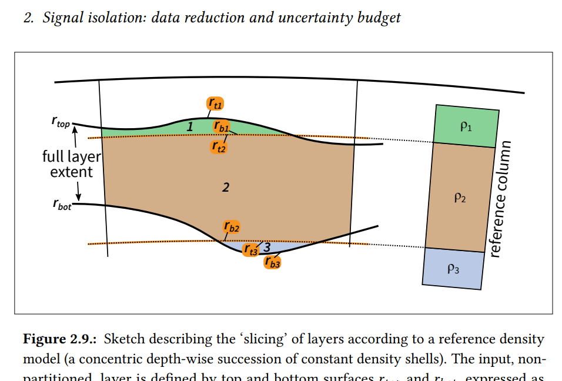
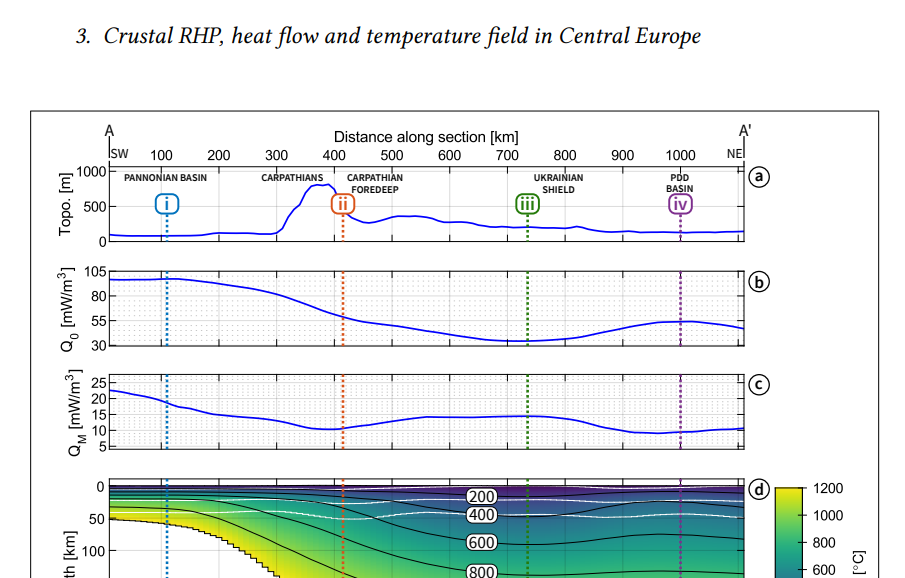

# Source for the text of: Pastorutti, A. (2020) Inferring the lithospheric thermal structure from satellite gravimetry.

This repository contains the LaTeX source, bibliography and figures for my doctoral dissertation _submitted in partial fulfillment of the requirements for the degree_.
Its _version of record_ can be reached at this handle: [hdl.handle.net/11368/2961201](https://hdl.handle.net/11368/2961201).

I have defended this thesis on 2020-03-20 in Trieste, Italy.

>_Excerpt from figure 2.9:_
>
>

>_Excerpt from figure 3.17:_
>
>

## Citing

```bibtex
@phdthesis{Pastorutti2020PhDThesis,
  author = {Pastorutti, Alberto},
  keywords = {error propagation,gravimetry,lithosphere,surface heat flow,thermal modelling},
  school = {Universit{\`{a}} degli studi di Trieste},
  title = {{Inferring the lithospheric thermal structure from satellite gravimetry}},
  type = {PhD thesis},
  url = {https://hdl.handle.net/11368/2961201},
  year = {2020}
}
```

> Pastorutti, A. (2020). Inferring the lithospheric thermal structure from satellite gravimetry. Università degli studi di Trieste. Retrieved from [hdl.handle.net/11368/2961201](https://hdl.handle.net/11368/2961201)

Consider citing this paper covering the thermal modelling-fitting segment:

```bibtex
@article{Pastorutti2019GJI,
author = {Pastorutti, Alberto and Braitenberg, Carla},
doi = {10.1093/gji/ggz344},
issn = {0956-540X},
journal = {Geophysical Journal International},
keywords = {composition and structure of,gravity anomalies and earth,heat flow,heat generation and transport,satellite gravity,structure,the continental crust},
month = {nov},
number = {2},
pages = {1008--1031},
title = {{A geothermal application for GOCE satellite gravity data: modelling the crustal heat production and lithospheric temperature field in Central Europe}},
volume = {219},
year = {2019}
}
```

> Pastorutti, A., & Braitenberg, C. (2019). A geothermal application for GOCE satellite gravity data: modelling the crustal heat production and lithospheric temperature field in Central Europe. Geophysical Journal International, 219(2), 1008–1031. [doi:10.1093/gji/ggz344](https://doi.org/10.1093/gji/ggz344)

A good deal of the rest of the thesis deals with the forward modelling of global reductions to gravity models, including a strategy to propagate uncertainties in the input mass to reductions.
This, along with an in-depth description of the numerical setup for the finite difference thermal solver, is of a more monographic nature and can be found only in the thesis.

A rendered pdf of the archived thesis (post-review, pre-defense version) is provided in a release: [releases/tag/postreview-version](https://github.com/apasto/apasto_phd_thesis/releases/tag/postreview-version).

## License

This work is licensed under a
[Creative Commons Attribution 4.0 International License][cc-by].

[![CC BY 4.0][cc-by-image]][cc-by]

[cc-by]: http://creativecommons.org/licenses/by/4.0/
[cc-by-image]: https://i.creativecommons.org/l/by/4.0/88x31.png
[cc-by-shield]: https://img.shields.io/badge/License-CC%20BY%204.0-lightgrey.svg
